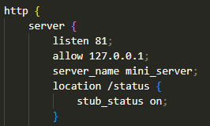
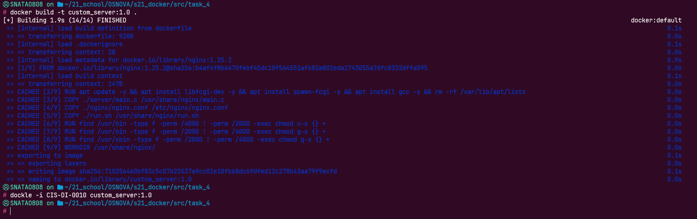

## Part 1. Ready-made docker
### Pulling nginx image from dockerhub:  
  
### Listing images:  
  
### Creating and running a container:  
  
### Listing containers:  
   
### Viewing information of the container:  
  
* Size -> 1095 bytes for read/write layer, 186641037 bytes for Root file system layer  
  
  
* Ports -> 80/tcp  
  
* IP -> 172.17.0.4  
  
### Stopping the nginx image:  
  
  
### Confirming that our image stopped:  

### Running nginx on ports 80 and 443 on localhost:  
  
  
  

## Part 2. Operations with container
### Reading the nginx.conf configuration file:  
 
### Creating nginx.conf file on local machine:  

### Configuring nginx file:  
 
### Copying nginx.conf file inside the docker image:  

### Restarting nginx inside the docker image:  

### Checking localhost:80/status:  
  
### Exporting container:  
  
### Stopping the container:  
  
### Deleting nginx image and container:  
  
### Importing our image back:  
 
### Running the imported container:  
  
### Checking localhost:80/status:  
  
## Part 3. Mini web server  
### Writing a mini server in C:  
  
### Running the written mini server via spawn-fcgi on port 8080:  
  
### Write nginx.conf that will proxy all requests from port 81 to 127.0.0.1:8080:  
  
### Checking that browser on localhost:81 returns Hello World:  
  
## Part 4. Your own docker
### Dockerfile of the image:  
  
### Building the docker image:  
  
### Checking with docker images:  
  
### Running our image:  
  
### Checking our webpage:  
  
### Adding proxying of status page in nginx.conf:  
  
### Restarting our container:  
  
### Checking nginx status page:  
  
## Part 5. Dockle
  
## Part 6. Simple Docker Compose
### Docker compose.yaml file:  
  
### Building the project:  
  
### Running the project:  
  
### Checking localhost:80:  
  
